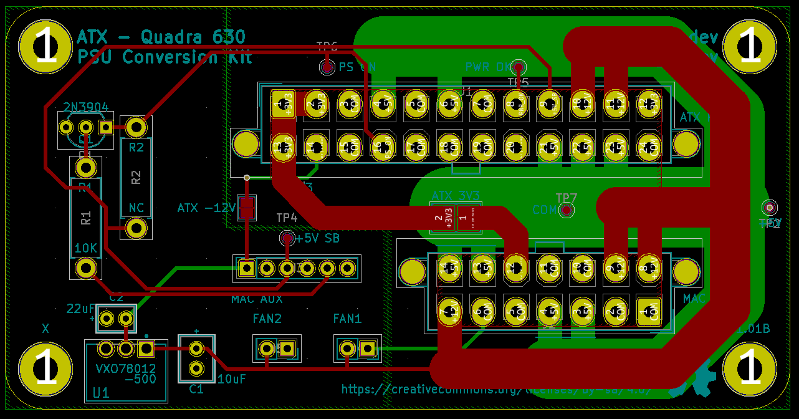

# ATX - Quadra 630 PSU Conversion Kit

This is an ATX/Quadra 630 PSU conversion PCB that I designed a while ago and
never got around to uploading.

[BOM](bom.csv)

**I am not an electrical engineer. I take no responsibility for any damage
these designs may cause. Use these designs with extreme caution.**

## Quick Notes
* R2 is unused.
* U1, C1, and C2 provide the -12V rail. If your PSU provides -12V, do not
populate these. Instead, bridge the "ATX -12V" jumper.
* 3.3V is not connected by default. The PSU in the original Quadra 630 PSU
uses this wire for ground. While the motherboards I tested did not actually
connect this wire, I have left it not connected by default. If you need 3.3V,
bridge the "ATX 3V3" jumper.
* I can't a good connector for the 6-pin "MAC-AUX" connector. The BOM
references the best fitting part although the smaller wall has to be cut in
order for the connector to fit. 
* PCB was designed with 2oz copper in mind.

## License and Copyright

Copyright &copy; Dean Winger 2021

This work is licensed under the Creative Commons
Attribution-ShareAlike 4.0 International License. To view a copy of
this license, visit http://creativecommons.org/licenses/by-sa/4.0/ or
send a letter to Creative Commons, PO Box 1866, Mountain View, CA
94042, USA.
